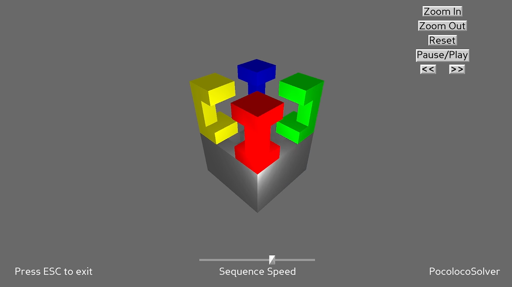

# Pocoloco Solver 

Pocoloco solver solves the [Pocoloco Puzzle](https://rombol.de/products/poco-loco-yavuz-demirhan-turkei-2014-holzspiel-denkspiel-knobelspiel-geduldspiel-aus-holz?srsltid=AfmBOoqXSUB5CWBYS7NhAHXwsx_IGFGyIFNRlFZKRMo88o-vCOwNQh5x) in Python with 3d visualization



> [!CAUTION]
> This project only works on Windows

## 🙌 Installation and Configuration

1. Clone the repository:

```bash
git clone https://github.com/Dino-Kupinic/PocolocoSolver.git
cd PocolocoSolver
```

2. Create and activate a Python virtual environment:

```bash
python -m venv venv
source venv/bin/activate 
```

3. Install required packages:

```bash
pip install -r requirements.txt
pip install panda3d
```

4. Run the application:

```bash
python src/playground.py
```

5. Start the renderer:

```bash
python src/visualisation/renderer.py
```

## 😎 Authors

- [@Dino Kupinic](https://www.github.com/Dino-Kupinic)
- [@Michael Ploier](https://www.github.com/MPloier)
- [@Lukas Bauer](https://www.github.com/PhyToN-xD)
- [@Daniel Samhaber](https://www.github.com/dsamhabe)
- [@Melanie Rahofer](https://www.github.com/mrahofer)
- [@Karaman Samed](https://www.github.com/SKaramanGit)

## 👀 Technologies

Python, Panda3D, NumPy, PyTest

## 🦞 License

[MIT](https://choosealicense.com/licenses/mit/)
